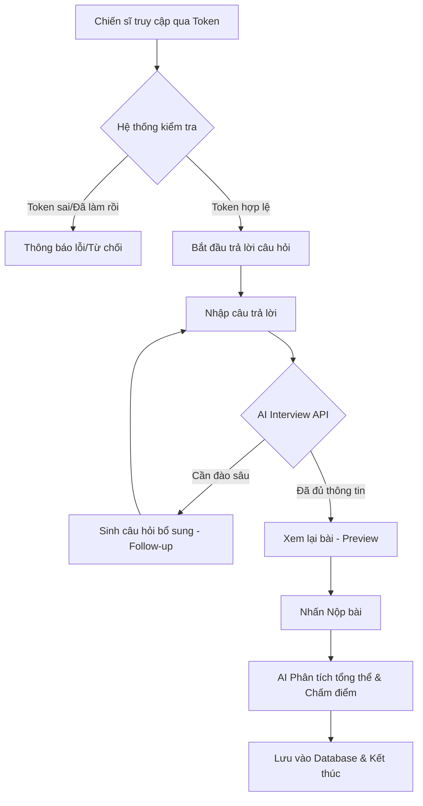
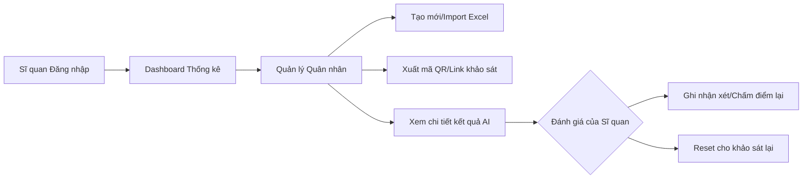

# 🪖 Army AI Sentiment Survey - Workflow & Developer Guide

Tài liệu này cung cấp cái nhìn chi tiết về cách hệ thống vận hành, các luồng dữ liệu (Workflows) và cấu trúc kỹ thuật dành cho lập trình viên (Fresher) hoặc người mới tiếp cận dự án.

---

## 🏗 1. Kiến trúc Tổng quan (System Architecture)

Hệ thống được xây dựng theo mô hình **Modern Web Stack**:
- **Frontend**: Next.js 15 (App Router) + Tailwind CSS + Shadcn UI.
- **Backend (Server Actions)**: Xử lý logic nghiệp vụ trực tiếp trên server, tương tác với Database.
- **Database**: Supabase (PostgreSQL) lưu trữ thông tin quân nhân, câu hỏi và kết quả khảo sát.
- **AI Engine**: Google Gemini (2.0/2.5/3.0) xử lý phân tích tâm lý qua API.

---

## 🔄 2. Các Luồng Nghiệp vụ Chính (Core Workflows)

### A. Luồng Khảo sát Chiến sĩ (Soldier Survey Flow)
Đây là luồng quan trọng nhất, nơi AI tương tác trực tiếp để thu thập tâm tư.

**Kỹ thuật liên quan:**
- `src/app/survey/[token]/page.tsx`: Trang đích nhận diện chiến sĩ.
- `src/components/survey/SurveyForm.tsx`: Component quản lý trạng thái khảo sát (trả lời, quay lại, lưu nháp).
- `src/app/api/interview/route.ts`: API gọi AI trong lúc đang làm bài để sinh câu hỏi phụ.
- `src/app/actions/survey-actions.ts`: Chứa hàm `submitSurveyAndAnalyze` để chấm điểm và lưu kết quả cuối cùng.

---

### B. Luồng Quản trị & Phân tích (Admin/Officer Flow)
Dành cho Sĩ quan quản lý để theo dõi và can thiệp.

**Kỹ thuật liên quan:**
- `src/app/admin/soldiers/page.tsx`: Quản lý danh sách, tìm kiếm, lọc theo trạng thái (An tâm, Nguy cơ).
- `src/app/actions/admin-actions.ts`: Các hàm Server Actions như `createSoldier`, `updateSubmissionStatus`, `resetSoldierSurvey`.
- `src/app/admin/profile/page.tsx`: Quản lý thông tin cá nhân và chữ ký sĩ quan.

---

## 🛠 3. Giải thích cấu trúc thư mục cho Fresher

Nếu bạn là dev mới, hãy chú ý các thư mục sau:

- **`src/app/actions/`**: Nơi chứa toàn bộ logic tương tác với Database. Chúng tôi sử dụng Server Actions thay vì API truyền thống để code gọn và bảo mật hơn.
  - `survey-actions.ts`: Logic nộp bài, phân tích AI.
  - `admin-actions.ts`: Logic quản lý quân nhân, reset dữ liệu.
- **`src/app/api/`**: Chỉ chứa các API cần gọi từ phía Client-side (như luồng hỏi đáp với AI trong lúc làm bài).
- **`src/components/`**:
  - `ui/`: Các component nhỏ, dùng chung (nút, ô nhập liệu, hộp thoại) từ Shadcn.
  - `survey/`: Logic phức tạp của form khảo sát.
- **`src/lib/`**: Chứa cấu hình các công cụ bên ngoài (Supabase client, Gemini AI config).
- **`src/utils/`**: Các hàm bổ trợ (format ngày tháng, xử lý chuỗi).

---

## 🤖 4. Cơ chế Phân tích AI (AI Analysis Logic)

Hệ thống không chỉ lưu câu trả lời, mà còn thực hiện:
1. **Real-time Follow-up**: Trong khi chiến sĩ gõ, AI nhận diện các từ khóa tiêu cực (buồn, áp lực, mệt mỏi) để hỏi thêm.
2. **Post-submission Analysis**:
   - **Score (0-100)**: Điểm số tâm lý (càng cao càng ổn định).
   - **Status**: Phân loại 🟢 An tâm, 🟡 Dao động, 🔴 Nguy cơ.
   - **Advice**: Gợi ý cho chỉ huy cách tiếp cận.
   - **Dialogue Script**: Mẫu câu hỏi để chỉ huy dùng khi gặp riêng chiến sĩ.

---

## 🔐 5. Quy tắc Bảo mật

1. **Token-based**: Mỗi link khảo sát là duy nhất và chỉ dùng được 1 lần (`is_completed = true`).
2. **RBAC**: Sĩ quan chỉ xem được dữ liệu của quân nhân thuộc đơn vị mình (hoặc theo phân quyền).
3. **Service Role**: Các thao tác nhạy cảm (xóa, reset) được thực hiện qua `adminClient` với quyền tối cao trên server để tránh bypass RLS.

---
*Tài liệu này giúp bạn hình dung bức tranh tổng thể. Hãy bắt đầu đọc từ `src/app/actions/survey-actions.ts` để hiểu logic cốt lõi nhất của dự án.*
