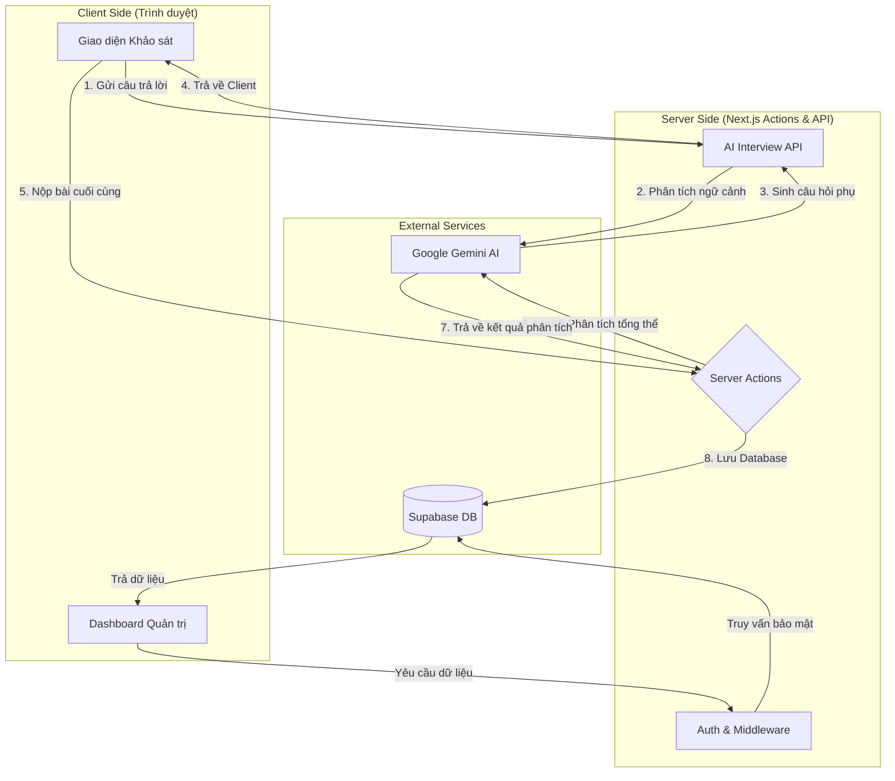

# 🪖 Hướng dẫn Vận hành & Luồng Dữ liệu - Army AI Sentiment Survey

Chào mừng bạn đến với hệ thống **Army AI Sentiment Survey** - giải pháp tiên tiến hỗ trợ nắm bắt tâm tư, nguyện vọng chiến sĩ thông qua trí tuệ nhân tạo. Tài liệu này đóng vai trò như một bản đồ chi tiết dành cho cả người mới bắt đầu (Fresher) và người dùng lần đầu, giúp bạn hiểu rõ "linh hồn" của ứng dụng này.

---

## 🌟 1. Những Tính năng Nổi bật (Core Features)

Dưới đây là lý do tại sao hệ thống này vượt trội so với các form khảo sát thông thường:

1.  **AI Interviewer (Phỏng vấn thực tế ảo)**: Không chỉ là trắc nghiệm. Khi chiến sĩ trả lời, AI sẽ phân tích cảm xúc ngay lập tức và đặt các câu hỏi đào sâu (Follow-up) nếu phát hiện dấu hiệu bất thường hoặc thông tin chưa rõ ràng.
2.  **Phân tích Tâm lý Đa chiều**: Hệ thống sử dụng mô hình ngôn ngữ lớn để chấm điểm trạng thái tâm lý (0-100) và phân loại mức độ: 🟢 An tâm, 🟡 Dao động, 🔴 Nguy cơ.
3.  **Bảng Điều khiển Sĩ quan (Officer Dashboard)**: Giao diện "Cyber Defense" hiện đại, cung cấp cái nhìn toàn cảnh về tình hình tư tưởng của toàn đơn vị qua biểu đồ và số liệu thực.
4.  **Tự động hóa QR & Token**: Mỗi quân nhân có một mã định danh duy nhất, đảm bảo tính bảo mật, trung thực và mỗi người chỉ làm khảo sát được một lần.
5.  **Góp ý Hệ thống (Feedback System)**: Tích hợp ngay trong giao diện quản trị để người dùng đóng góp ý tưởng hoàn thiện ứng dụng.

---

## 👥 2. Các Vai trò Người dùng (User Roles)

Hệ thống được thiết kế cho hai đối tượng chính:

*   **Chiến sĩ (Soldier)**: Người trực tiếp tham gia khảo sát. Không cần đăng nhập, chỉ cần truy cập qua link/QR được cấp.
*   **Sĩ quan/Quản trị viên (Officer/Admin)**: Người quản lý danh sách, theo dõi kết quả, xuất báo cáo và nắm bắt tình hình đơn vị.

---

## 🔄 3. Toàn bộ Quy trình Vận hành (Full Workflow)

Quy trình từ lúc chuẩn bị đến khi có kết quả phân tích diễn ra qua 4 bước:

### Bước 1: Chuẩn bị Dữ liệu (Admin)
Sĩ quan đăng nhập vào hệ thống, tạo danh sách quân nhân hoặc nhập từ file Excel. Hệ thống sẽ tự động tạo cho mỗi người một **Token** bảo mật và **Mã QR**.

### Bước 2: Thực hiện Khảo sát (Soldier)
Chiến sĩ quét mã QR để bắt đầu. 
*   **Giai đoạn 1**: Trả lời các câu hỏi nền tảng.
*   **Giai đoạn 2 (AI Interaction)**: AI đọc câu trả lời và tự động hỏi thêm 2-3 câu hỏi phụ để tìm hiểu sâu hơn về những lo lắng hoặc mong muốn của chiến sĩ.

### Bước 3: Phân tích & Chấm điểm (AI Engine)
Sau khi nhấn "Nộp bài", dữ liệu được gửi đến AI Engine (Gemini). AI sẽ thực hiện:
*   Đánh giá mức độ trung thực và thái độ.
*   Chấm điểm trạng thái tâm lý.
*   Đưa ra lời khuyên (Advice) cho chỉ huy để tiếp cận chiến sĩ hiệu quả nhất.

### Bước 4: Theo dõi & Xử lý (Officer)
Sĩ quan xem kết quả trên Dashboard. Những trường hợp nằm trong diện 🔴 **Nguy cơ** sẽ được ưu tiên hiển thị để chỉ huy có biện pháp can thiệp, động viên kịp thời.

---

## 📊 4. Luồng Dữ liệu (Data Flow)

Dưới đây là sơ đồ thể hiện cách dữ liệu di chuyển trong hệ thống:

---

## 🛠 5. Hướng dẫn cho người mới (Newbie Guide)

Nếu bạn là lập trình viên mới tiếp cận dự án, hãy nắm vững các quy tắc sau:

1.  **Giao diện (UI/UX)**: Chúng ta sử dụng phong cách **Glassmorphism** và **Dark Mode**. Mọi thành phần phải đảm bảo tính thẩm mỹ cao, chuyên nghiệp (sử dụng Tailwind CSS và Framer Motion).
2.  **Logic Nghiệp vụ**: 
    *   Hầu hết các logic tương tác database nằm trong `src/app/actions/`.
    *   Logic AI nằm tại `src/app/api/interview/` (thời gian thực) và `src/app/actions/survey-actions.ts` (sau khi nộp).
3.  **Bảo mật**: Tuyệt đối không để lộ `SUPABASE_SERVICE_ROLE_KEY`. Mọi thao tác xóa/sửa dữ liệu nhạy cảm phải được kiểm tra quyền hạn chặt chẽ qua Server Actions.

---

## ❓ 6. Các câu hỏi thường gặp (FAQ)

*   **Dữ liệu có được bảo mật không?** Có, mỗi khảo sát gắn liền với một token chỉ sử dụng một lần.
*   **AI có thể bị "đánh lừa" không?** AI được thiết kế để nhận diện các câu trả lời hời hợt hoặc mâu thuẫn và sẽ đặt câu hỏi để xác minh lại.
*   **Làm sao để xuất báo cáo?** Trong trang chi tiết quân nhân, hệ thống hỗ trợ xem và in kết quả dưới dạng hồ sơ tâm lý chuyên nghiệp.

---
*Tài liệu này được soạn thảo bởi **Antigravity** - Người hiểu rõ hệ thống này nhất. Chúc bạn có trải nghiệm tuyệt vời cùng Army AI Survey!*
